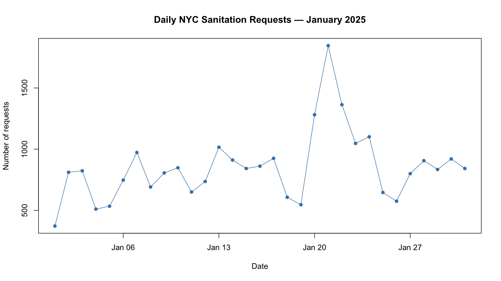

```{r}
#| include: false
january <- readRDS("data/processed/dsny_jan2025_clean.rds")
borough_summary <- read.csv("outputs/january_by_borough.csv")

total_requests <- format(nrow(january), big.mark = ",")
median_hours <- round(
  median(january$closure_hours, na.rm = TRUE),
  2
)
missing_dates <- sum(is.na(january$closed_date))
```

## Row {.flow}

::: {.valuebox color="primary"}
Total requests

`r total_requests`
:::

::: {.valuebox color="primary"}
Median time to closure

`r paste(median_hours, "hours")`
:::

::: {.valuebox color="secondary"}
Missing closure dates

`r missing_dates`
:::

## Row {.flow}

```{r}
#| title: "Most common request types"
#| out-width: "100%"
knitr::include_graphics("outputs/january_top10_requests.png")
```

## Row {.flow}

```{r}
#| title: "Daily request volume"
#| out-width: "100%"

```

## Row {.flow}

```{r}
#| title: "Requests by borough"
knitr::kable(
  borough_summary[c("borough", "total_requests", "median_hours")],
  col.names = c("Borough", "Requests", "Median closure hours"),
  digits = 2,
  format.args = list(big.mark = ",")
)
```

::: {.card title="Key findings"}
- January 21 was the busiest day, with **1,846 requests**.
- **Snow or Ice** accounted for **1,386 requests (75.08%)**
  that day, compared with **19.57%** across January.
- **Lot Condition** had missing closure dates for
  **46 of 59 requests**. Its closure-time statistics describe
  only the remaining 13 requests.
:::

## Row {.flow}

::: {.card title="How to interpret this dashboard"}
Requests were created in January 2025 and assigned to DSNY.
Closure dates may occur in later months.

Closure-time statistics exclude records without a closure date.
Recorded closure does not necessarily mean the underlying
problem was solved.

Borough comparisons reflect different mixes of request types.
These results alone do not explain the causes of differences.

Source: [NYC Open Data](https://data.cityofnewyork.us/d/erm2-nwe9).
:::