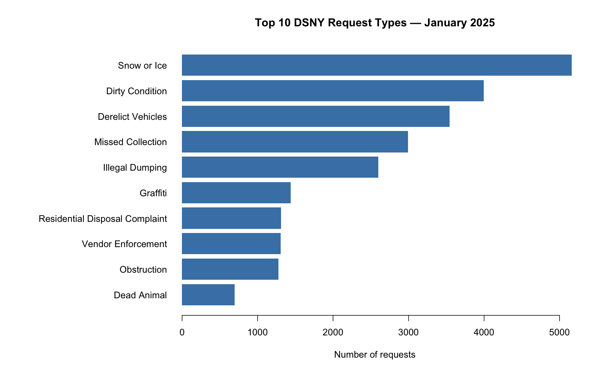

```{r}
#| include: false
january <- readRDS("data/processed/dsny_jan2025_clean.rds")
borough_summary <- read.csv("outputs/january_by_borough.csv")
```

## Row {height=20%}

```{r}
#| content: valuebox
#| title: "Total requests"
list(
  color = "primary",
  value = format(nrow(january), big.mark = ",")
)
```

```{r}
#| content: valuebox
#| title: "Median time to closure"
list(
  color = "primary",
  value = paste(
    round(median(january$closure_hours, na.rm = TRUE), 2),
    "hours"
  )
)
```

```{r}
#| content: valuebox
#| title: "Missing closure dates"
list(
  color = "secondary",
  value = sum(is.na(january$closed_date))
)
```

## Row {height=55%}

```{r}
#| title: "Most common request types"

```

```{r}
#| title: "Requests by borough"
knitr::kable(
  borough_summary[c("borough", "total_requests", "median_hours")],
  col.names = c("Borough", "Requests", "Median closure hours")
)
```

## Row {height=25%}

::: {.card title="How to interpret this dashboard"}
Requests were created in January 2025 and assigned to DSNY.
Closure dates may occur in later months.

Closure-time statistics exclude records without a closure date.
Recorded closure does not necessarily mean the underlying problem
was solved. Borough comparisons also reflect different mixes of
request types.

Source: [NYC Open Data](https://data.cityofnewyork.us/d/erm2-nwe9).
:::